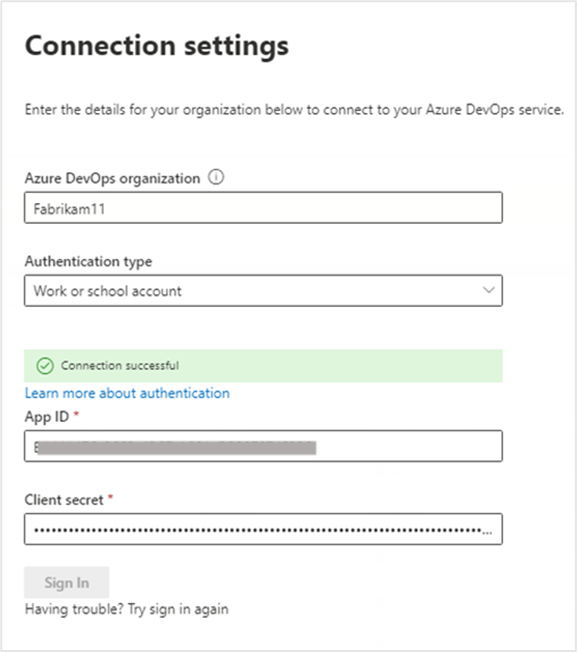

<!---Previous ms.author: shgrover --->

# Conector de Azure DevOps Graph (versión preliminar)

El conector de Azure DevOps Graph permite a su organización indizar elementos de trabajo en su instancia del servicio Azure DevOps. Después de configurar el conector y el contenido de índice de Azure DevOps, los usuarios finales pueden buscar esos elementos en Microsoft Search.

> [!NOTE]
> Lea el [**artículo sobre el programa de instalación del conector de Graph**](configure-connector.md) para comprender el proceso de configuración general de los conectores de Graph.

Este artículo está dirigido a cualquier persona que configure, ejecute y monitore un conector de ServiceNow Graph. Complementa el proceso de configuración general y muestra instrucciones que solo se aplican al conector de ServiceNow Graph.

>[!IMPORTANT]
>El conector de Azure DevOps solo admite el servicio en la nube de Azure DevOps. Este conector no admite Azure DevOps Server 2019, TFS 2018, TFS 2017, TFS 2015 y TFS 2013.

<!---## Before you get started-->

<!---Insert "Before you get started" recommendations for this data source-->

## Paso 1: Agregar un conector de Graph en el Centro de administración de Microsoft 365

Siga las instrucciones [generales de configuración.](https://docs.microsoft.com/microsoftsearch/configure-connector)
<!---If the above phrase does not apply, delete it and insert specific details for your data source that are different from general setup 
instructions.-->

## Paso 2: Nombrar la conexión

Siga las instrucciones [generales de configuración.](https://docs.microsoft.com/microsoftsearch/configure-connector)
<!---If the above phrase does not apply, delete it and insert specific details for your data source that are different from general setup 
instructions.-->

## Paso 3: Configurar las opciones de conexión

Para conectarse a la instancia de Azure DevOps, necesita el nombre de la organización de Azure [DevOps,](https://docs.microsoft.com/azure/devops/organizations/accounts/create-organization) su id. de aplicación y el secreto de cliente para la autenticación de OAuth.

### Registrar una aplicación

Registra una aplicación en Azure DevOps para que la aplicación búsqueda de Microsoft pueda acceder a la instancia. Para obtener más información, consulte la documentación de Azure DevOps sobre cómo [registrar una aplicación.](https://docs.microsoft.com/azure/devops/integrate/get-started/authentication/oauth?view=azure-devops#register-your-app&preserve-view=true)

En la tabla siguiente se proporcionan instrucciones sobre cómo rellenar el formulario de registro de la aplicación:

Campos obligatorios | Descripción | Valor recomendado
--- | --- | ---
| Nombre de la compañía         | El nombre de su empresa. | Usar un valor adecuado   |
| Nombre de la aplicación     | Un valor único que identifica la aplicación que está autorizando.    | Búsqueda de Microsoft     |
| Sitio web de la aplicación  | La dirección URL de la aplicación que solicitará acceso a la instancia de Azure DevOps durante la instalación del conector. (Obligatorio).  | https://gcs.office. com/
| Url de devolución de llamada de autorización        | Dirección URL de devolución de llamada necesaria a la que redirige el servidor de autorización. | https://gcs.office. com/v1.0/admin/oauth/callback|
| Ámbitos autorizados | El ámbito de acceso de la aplicación | Seleccione los siguientes ámbitos: Identidad (lectura), Elementos de trabajo (lectura), Grupos de variables (lectura), Proyecto y equipo (lectura), Gráfico (lectura)|

Al registrar la aplicación con los detalles anteriores, recibirá  el identificador de aplicación y el secreto de cliente que se usarán para configurar el conector. 

>[!NOTE]
>Para revocar el acceso a cualquier aplicación registrada en Azure DevOps, ve a Configuración de usuario en la parte superior derecha de la instancia de Azure DevOps. Seleccione Perfil y, a continuación, seleccione Autorizaciones en la sección Seguridad del panel lateral. Mantenga el puntero sobre una aplicación de OAuth autorizada para ver el botón Revocar en la esquina de los detalles de la aplicación.

### Configuración de conexión

Después de registrar la aplicación DevOps de Microsoft Search con Azure DevOps, puede completar el paso de configuración de conexión. Escribe el nombre de la organización, el id. de aplicación y el secreto de cliente.

### Configurar datos: seleccionar proyectos y campos

Puede elegir que la conexión indexe toda la organización o proyectos específicos.

Si decide indizar toda la organización, se indizarán los elementos de todos los proyectos de la organización. Los nuevos proyectos y elementos se indizarán durante el siguiente rastreo después de crearlos.

Si elige proyectos individuales, solo se indizarán los elementos de trabajo de esos proyectos.

A continuación, seleccione los campos que desea que la conexión indexe y obtenga una vista previa de los datos de estos campos antes de continuar.

## Paso 4: Administrar permisos de búsqueda

El conector de Azure DevOps admite permisos de búsqueda visibles solo para las personas con  **acceso a este** origen de datos o **todos.** Si elige solo las personas con acceso a este origen de **datos,** los datos indizados aparecerán en los resultados de la búsqueda para los usuarios que tengan acceso a ellos en función de los permisos para usuarios o grupos en el nivel de ruta de acceso organización, proyecto o área en Azure DevOps. Si elige **Todos, los** datos indizados aparecerán en los resultados de búsqueda de todos los usuarios.

## Paso 5: Asignar etiquetas de propiedad

Siga las instrucciones [generales de configuración.](https://docs.microsoft.com/microsoftsearch/configure-connector)

## Paso 6: Administrar esquema

Siga las instrucciones [generales de configuración.](https://docs.microsoft.com/microsoftsearch/configure-connector)

## Paso 7: Elegir la configuración de actualización

El conector de Azure DevOps admite programaciones de actualización para rastreos completos e incrementales.
La programación recomendada es una hora para un rastreo incremental y un día para un rastreo completo.

## Paso 8: Revisar la conexión

Siga las instrucciones [generales de configuración.](https://docs.microsoft.com/microsoftsearch/configure-connector)
<!---If the above phrase does not apply, delete it and insert specific details for your data source that are different from general setup 
instructions.-->

<!---## Troubleshooting-->
<!---Insert troubleshooting recommendations for this data source-->

<!---## Limitations-->
<!---Insert limitations for this data source-->
