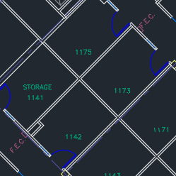
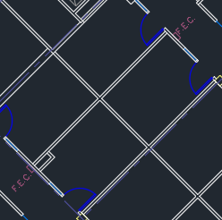
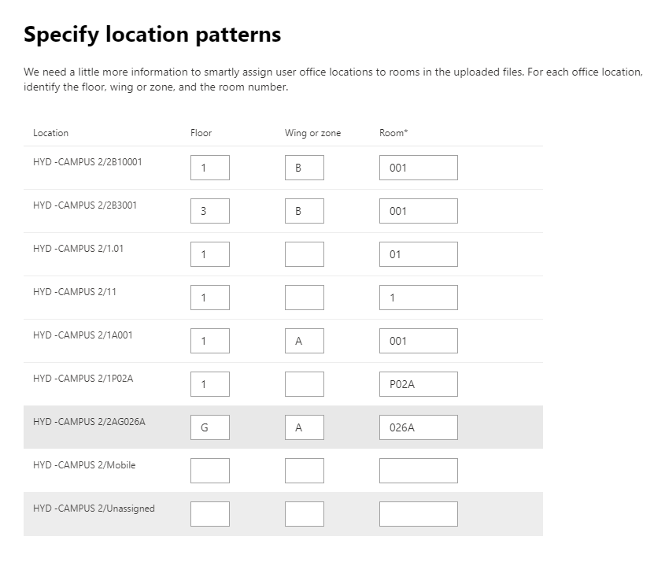

# Administrar planos de planta

Los planes de planta en **Microsoft Search** ayudan a los usuarios a encontrar personas y salas de reuniones dentro de un edificio. Los planes de planta responden las siguientes preguntas:

- ¿Dónde se encuentra la oficina de Allan-Young?
- Edificio 2, piso 3
- Buscar 2/11173

## Agregar planos de planta

Siga estos pasos para configurar las respuestas de los planes de planta en **Microsoft Search**.

### Paso 1: determinar los códigos de creación

Los códigos de creación se usan como parte de la ubicación de la oficina de un usuario. Usará estos códigos al actualizar los perfiles de usuario. Supongamos que su organización tiene un edificio en esta ubicación: *Building 2, 350 5º Avenue, Nueva York City, NY 10016*

A continuación, se muestran algunos buenos ejemplos para el código de este edificio: 2, B2, Building2, Building 2 o NYCB2. Cada edificio debe tener un código único.

### Paso 2: revisar los planes de planta

Los archivos de planos de planta deben tener formato DWG; Los archivos DWG pueden contener etiquetas de texto. Cuando una etiqueta de texto marca un salón, se denomina etiqueta de sala. El archivo DWG debe tener **al menos 10 salones** marcados con etiquetas. A continuación se muestran algunos ejemplos de archivos DWG con diferentes tipos de etiquetas:

|**Etiquetas de texto que incluyen etiquetas de sala**|**Etiquetas de texto, pero sin etiquetas de sala**|**Sin etiquetas de texto**|
|:-----:|:-----:|:-----:|
||||

Consulte la sección [p + f](#frequently-asked-questions) para obtener información sobre cómo ver y actualizar archivos DWG.

### Paso 3: actualizar las ubicaciones de Office en los perfiles de usuario

La ubicación de la oficina de un usuario es una combinación de un código de edificio y una etiqueta de sala. Por ejemplo, si el código de edificio es *2* y la etiqueta de sala es *1173*, la ubicación de la Oficina sería *2/1173*.

Agregar o actualizar ubicaciones de oficina para cada usuario de la organización. Puede cambiar la ubicación de la oficina en el perfil de usuario en el [centro de administración de Microsoft 365](https://admin.microsoft.com) o puede cambiar en su Active Directory local para sincronizar con Azure Active Directory. *PhysicalDeliveryOfficeName* es el campo que se usa para la ubicación de la oficina. Si las etiquetas de salón no incluyen números de planta, consulte las preguntas más frecuentes para obtener sugerencias.

En este ejemplo, la oficina de Allan está en el salón 1173 en el piso 1 del edificio 2.

> [!NOTE]
> Para ver las ubicaciones de Office actualizadas al buscar planes de planta, debe actualizar las ubicaciones de Office para **al menos 10 personas** en cada planta.

### Paso 4: comprobar la ubicación de la oficina

Use **Microsoft Search** para buscar un usuario y comprobar que la ubicación de la oficina aparece correctamente. Si acaba de actualizar las ubicaciones, es posible que tenga que esperar hasta **72 horas** para que las actualizaciones aparezcan en los resultados de la búsqueda.

### Paso 5: agregar ubicaciones de edificio

Planos de planta usa [ubicaciones](manage-locations.md) para definir los edificios. En el [centro de administración de Microsoft 365](https://admin.microsoft.com), vaya a [**ubicaciones**](https://admin.microsoft.com/Adminportal/Home#/MicrosoftSearch/locations)y, después, seleccione **Agregar**. Escriba el nombre, la dirección y las palabras clave del edificio. Agregue tantos edificios como necesite.

Para obtener más información acerca de las ubicaciones, consulte [Manage locations](manage-locations.md)

### Paso 6: recopilar y organizar ubicaciones de oficina

Antes de poder usar planos de planta, las ubicaciones de oficina deben estar indizadas. Se trata de una operación de una sola vez que puede tardar hasta 48 horas en completarse. El tiempo total dependerá del tamaño de la organización.

En el [centro de administración](https://admin.microsoft.com), vaya a planes de [**planta**](https://admin.microsoft.com/Adminportal/Home#/MicrosoftSearch/floorplans)y, a continuación **, seleccione introducción**. Si no ve este aviso, este paso ya se ha completado para su organización

### Paso 7: cargar planes de planta

1. En el [centro de administración](https://admin.microsoft.com), vaya a [**planes de planta**](https://admin.microsoft.com/Adminportal/Home#/MicrosoftSearch/floorplans).
2. Seleccione un edificio en la lista desplegable y seleccione **siguiente**. Si el edificio no aparece en la lista, vuelva y [agregue ubicaciones de creación](#step-5-add-building-locations).
3. Seleccione **cargar archivos**y, a continuación, elija el plano de planta que quiera cargar.
4. Una vez completada la carga, debe especificar el número de planta que se representa en el archivo del plano de planta. Después, seleccione **Siguiente**.
5. Opcional Si el piso tiene alas o zonas, escribe el detalle.
6. Verá una pantalla de revisión con el número de ubicaciones de oficina que se han asignado a los planes de planta. Seleccione **detalles** para asegurarse de que la asignación es correcta.
    - Si no se ha asignado ningún usuario o no está satisfecho con la asignación, seleccione **continuar asignación**. Para publicar, seleccione **omitir y publicar**.
7. Especifique el código de creación para este plano de planta. El código de edificio puede encontrarse en la propiedad de la ubicación de la oficina de los usuarios. Por ejemplo, si la ubicación de la oficina de un usuario es **2/1173**, el código de edificio es **2**.
8. En la pantalla revisión, repita el paso 6 para asegurarse de que la asignación es correcta.
9. Opcional Revise e identifique los patrones de ubicación de todos los planes de planta cargados y, después, seleccione **siguiente**.
10. En la pantalla revisión, repita el paso 6 para asegurarse de que la asignación es correcta.
11. Cuando esté listo, seleccione **publicar** para que el plano de planta esté disponible en **Microsoft Search**.

> [!NOTE]
> **Se necesitan 48 horas para que se publiquen los planes de planta.** Una vez que los usuarios verán un resultado del plano de planta similar al siguiente cuando busquen la oficina de un compañero de trabajo.

### Paso 8: (opcional) especificar patrones de ubicación

Después de cargar un plano de planta, las etiquetas de texto se compararán con las ubicaciones de la oficina de los perfiles de los usuarios. Si hay menos de 10 resultados, aparecerá la pantalla **especificar patrones de ubicación** . Los patrones de ubicación se usan para extraer información sobre la planta, el ala y el salón de las ubicaciones de la oficina.

Solo se requiere un salón, los suelos y las alas son opcionales y puede omitir las ubicaciones según sea necesario.

## Editar planos de planta

Para actualizar un plano de planta existente, seleccione el plano de planta que desee cambiar y, a continuación, seleccione **Editar**. Realice los cambios y guárdelos.

## Solución de problemas

|**Paso**|**Mensaje de error**|**Tipo**|**Acción**|
|:-----|:-----|:-----|:-----|
|Cargar planos de planta|No se puede leer CC_1. dwg. Vuelva a cargar o eliminar el plano de planta.|Error|Intente cargar el archivo de nuevo. Si eso no funciona, elimine el archivo y vuelva a intentarlo.|
|Cargar planos de planta|Hay dos archivos denominados CC_1. dwg. Elimine uno de ellos o vuelva a cargarlo con otro nombre.|Error|Si el nombre de archivo no es correcto, agregue el nombre de archivo único agregando información de suelos o alas y, a continuación, vuelva a cargar el archivo. Si agregó por accidente el mismo archivo dos veces, simplemente elimínelo.|
|Cargar planos de planta|No se encontraron datos.|Error|Compruebe el archivo para asegurarse de que es el correcto y, a continuación, cárguelo de nuevo o elimínelo.|
|Cargar planos de planta|Faltan referencias externas en este archivo. Cargue CC_1_furniture. dwg o elimine este archivo.|Advertencia|Cargar archivos de referencia externos o eliminar.|
|Cargar planos de planta|No se pudieron leer los números o las etiquetas del salón en el archivo DWG. Elimine este archivo.|Advertencia|Compruebe el archivo DWG para asegurarse de que se incluyen los datos y, a continuación, elimine el archivo y vuelva a intentarlo.|
|Vincular ubicaciones de oficina|No se encontraron ubicaciones de Office en Azure Active Directory. Agregue datos de ubicación a Azure Active Directory antes de configurar los planes de planta.|Error|[Actualizar ubicaciones de Office en perfiles de usuario](#step-3-update-office-locations-on-user-profiles) |

## Preguntas frecuentes

**P:** ¿Cómo puedo ver y editar los archivos DWG?

**A:** Use cualquiera de estas opciones para ver los archivos DWG:

- Cargue el archivo en SharePoint y ábralo.
- Abra el archivo en [Microsoft Visio](https://support.office.com/article/Open-insert-convert-and-save-DWG-and-DXF-AutoCAD-drawings-60cab691-0f4c-4fc9-b775-583273c8dac5) o [Autodesk DWG TrueView](https://www.autodesk.com/products/dwg).
- Cargue el archivo en el [visor en línea de Autodesk](https://viewer.autodesk.com/).

**P:** ¿Cómo agrego etiquetas de texto a salas sin marcar?

**A:** Abra el archivo DWG en un editor y [agregue etiquetas de salón](https://knowledge.autodesk.com/support/autocad-map-3d/learn-explore/caas/CloudHelp/cloudhelp/2019/ENU/MAP3D-Learn/files/GUID-4854F184-6279-4E0C-9487-34A4759017F6-htm.html).

**P:** ¿Cómo puedo crear o editar archivos DWG con fines de prueba?

**A:** Cree un archivo DWG en Microsoft Visio, Autodesk AutoCAD o cualquier otro editor de DWG. Asegúrese de que 10 o más salas estén etiquetadas en el archivo.

**P:** ¿Cuál es el mejor formato para las etiquetas de texto en los archivos DWG?

**A:** Para obtener los mejores resultados, las etiquetas de texto deben contener números de planta y números de sala. Los ejemplos siguientes usan 2 o SC para el código de compilación.
<!-- markdownlint-disable no-inline-html -->
|Tipos de etiquetas de salón|Floor|Room|Etiqueta de texto de ejemplo|Ubicación de la oficina (edificio código/etiqueta de texto)|
|:-----|:-----|:-----|:-----|:-----|
|Tiene piso y número de sala|1|173|1173|2/1173|
|| 21|45|21045|2/21045|
||veintitrés|100.000|de 23 a 100 k|2/23-100 k|
||1|G06-07|1G06-07|2/1G06-07|
||segundo|1.024A|02.1024 un|2/02.1024 una|
||segundo|1.024A|02.1024 un|2/02.1024 una|
||segundo|105,01|2105,01|2/2105.01|
|Tiene el código de construcción, el piso y el número de sala|comprendi|X-11-M-12|2-0-X-11-M-12|2/2 -0-X-11-M-12 2-0-X-11-M-12|
||segundo|128A|22128A|2/22128A 22128A|
||1|B2-11|21-B2-11|2/21-B2-11 21-B2-11|
||segundo|45|SC2045|SC/SC2045 SC2045|

**P:** ¿Puedo usar un archivo DWG que no incluya números de planta?

**A:** Sí, puede hacerlo. Al actualizar ubicaciones de oficina en el perfil del usuario de Azure Active Directory, incluya el número de piso como parte del número de sala, incluso si falta en el archivo DWG. Después de cargar el archivo, aparecerá la pantalla especificar modelos de ubicación y puede indicar ambos valores.

Por ejemplo, un archivo DWG que incluya números de sala, pero sin números de piso, puede tener un aspecto similar a este:

La ubicación de la oficina del perfil del usuario debe ser 2/1175 donde "2" es el código de edificio, "1" es el número de piso y "175" es el número de sala.
