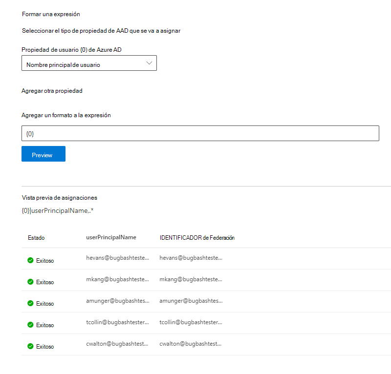

# Asignar las identidades de Azure AD  

Este artículo le guiará por los pasos de la asignación de identidades de Azure AD a un identificador único para su origen de datos (identidad que no es de Azure AD), de modo que los usuarios de la lista de control de acceso (ACL) con identidades que no son de Azure AD puedan ver los resultados de la búsqueda del conector en su ámbito.

Estos pasos solo son relevantes para los administradores de búsqueda que están configurando un conector de [Salesforce](salesforce-connector.md) por Microsoft con los permisos de búsqueda de "solo personas con acceso a este origen de datos" e identidad tipo "AAD". Los siguientes pasos le guiarán por el proceso de asignación de las propiedades de usuario de Azure AD a los **identificadores de Federación** de los usuarios.

>[!NOTE]
>Si está configurando un [conector de Salesforce](salesforce-connector.md) y **selecciona solo personas con acceso a este origen de datos** y un tipo de identidad **que no es AAD** en la pantalla de permisos de búsqueda, consulte el artículo sobre [mapas de identidades que no son de Azure ad](map-non-aad.md) para conocer los pasos sobre cómo asignar identidades que no son de Azure ad.  

## Pasos para asignar las propiedades de Azure AD

### 1. seleccionar Propiedades de usuario de Azure AD para asignar

Puede seleccionar las propiedades de Azure AD que necesita asignar al identificador de Federación.

Puede seleccionar una propiedad de usuario de Azure AD en la lista desplegable. También puede Agregar tantas propiedades de usuario de Azure AD como quiera si estas propiedades son necesarias para crear la asignación del identificador de Federación de su organización.

### 2. crear una fórmula para completar la asignación

Puede combinar los valores de las propiedades de usuario de Azure AD para formar el identificador de Federación único.

En el cuadro de fórmula, " {0} " corresponde a la *primera* propiedad de Azure ad que seleccionó. " {1} " corresponde a la *segunda* propiedad de Azure ad que seleccionó. " {2} " corresponde a la *tercera* propiedad de Azure ad, y así sucesivamente.  

A continuación se muestran algunos ejemplos de fórmulas con salidas de expresión regular de ejemplo y resultados de fórmulas:

| Fórmula de ejemplo                  | Valor de {0} la propiedad para un usuario de muestra                 | Valor de {1} la propiedad para un usuario de muestra           | Resultado de la fórmula                  |
| :------------------- | :------------------- |:---------------|:---------------|
| {0}.{1} @contoso. com  | Name | Apellido |firstname.lastname@contoso.com
| {0}@domain. com                 | identificado                 |             |userid@domain.com

Después de proporcionar la fórmula, puede hacer clic opcionalmente en **vista previa** para ver una vista previa de 5 usuarios aleatorios del origen de datos con sus correspondientes asignaciones de usuario aplicadas. El resultado de la vista previa incluye el valor de las propiedades de usuario de Azure AD seleccionadas en el paso 1 para los usuarios y el resultado de la fórmula final que se proporciona en el paso 2 para ese usuario. También indica si los resultados de la fórmula podrían resolverse en un usuario de Azure AD del espacio empresarial a través de un icono de "éxito" o "error".  

>[!NOTE]
>Todavía puede continuar con la creación de la conexión si una o más asignaciones de usuario tienen el estado "error" después de hacer clic en **vista previa**. La vista previa muestra 5 usuarios aleatorios y sus asignaciones desde el origen de datos. Si la asignación que proporciona no asigna todos los usuarios, es posible que experimente este caso.

## Ejemplo de asignación de Azure AD

Vea la siguiente instantánea para obtener una asignación de Azure AD de ejemplo.

## Limitaciones  

- Solo se admite una asignación para todos los usuarios. No se admiten las asignaciones condicionales.  

- No puede cambiar la asignación una vez publicada la conexión.  

- Las expresiones basadas en regex contra las propiedades de usuario de Azure AD no son compatibles con la transformación de ID de Federación de Azure AD.