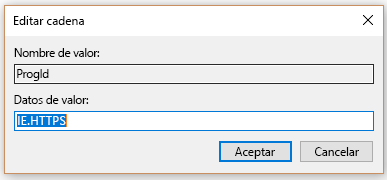

# Establecer explorador predeterminado

Configurar el explorador predeterminado, el motor de búsqueda predeterminado y la página principal predeterminada le ayudará a los usuarios a descubrir las capacidades de Microsoft Search, fomentar el uso más y proporcionar una experiencia más suave.
  
Para establecer el explorador predeterminado para la organización, siga los pasos siguientes.
  
## Windows 8 y anterior

Para configurar Internet Explorer o Microsoft Edge como el explorador predeterminado, siga estos pasos:
  
### Crear el archivo de asociaciones predeterminado

1. Abra una consola administrativa de PowerShell.
    
2.  `New-Item -Path "\\$env:USERDOMAIN\SYSVOL\$env:USERDNSDOMAIN" -Type Directory -Name "Settings"`
    
3.  `$SettingsPath="\\$env:USERDOMAIN\SYSVOL\$env:USERDNSDOMAIN\Settings"`
    
4.  `Start-Process Dism.exe -PassThru "/Online /Export-DefaultAppAssociations:$SettingsPath\AppAssoc.xml"`
    
Estos pasos probar y creación el archivo de asociaciones de forma predeterminada en la carpeta SYSVOL del controlador de dominio.
  
### Agregar o editar el archivo de asociaciones predeterminado

1. `Notepad "$SettingsPath\AppAssoc.xml"`
    
2. Editar las siguientes entradas (.htm, .html, http, https) y quitar otras entradas si no se necesitan.
    
  - **Microsoft Edge**
    
     `<Association Identifier=".htm" ProgId="AppX4hxtad77fbk3jkkeerkrm0ze94wjf3s9" ApplicationName="Microsoft Edge" />`
  
     `<Association Identifier=".html" ProgId="AppX4hxtad77fbk3jkkeerkrm0ze94wjf3s9" ApplicationName="Microsoft Edge" />`
  
     `<Association Identifier="http" ProgId="AppXq0fevzme2pys62n3e0fbqa7peapykr8v" ApplicationName="Microsoft Edge" />`
    
  - **Internet Explorer**
    
     `<Association Identifier=".htm" ProgId="htmlfile" ApplicationName="Internet Explorer" />`
  
     `<Association Identifier=".html" ProgId="htmlfile" ApplicationName="Internet Explorer" />`
  
     `<Association Identifier="http" ProgId="IE.HTTP" ApplicationName="Internet Explorer" />`
  
     `<Association Identifier="https" ProgId="IE.HTTPS" ApplicationName="Internet Explorer" />`
    
3. Abra la consola de administración de directivas de grupo (gpmc.msc) y cambie a la edición de cualquier directiva existente o crear uno nuevo.
    
1. Vaya a **configuración de usuario\Plantillas administrativas\Componentes Components\File Explorer de equipo**
    
2. Haga doble clic en **establecer un archivo de configuración de asociaciones de forma predeterminada**, establecida en **habilitado**y escriba la ruta de acceso a AppAssoc.xml (por ejemplo %USERDOMAIN%\SYSVOL\%USERDNSDOMAIN%\Settings\AppAssoc.xml)
    
4. Aplicar el GPO resultante mediante la vinculación al dominio apropiado.
    
Los usuarios podrán cambiar el explorador una vez establecida esta directiva.
  
## Windows 7

1. Configurar el equipo local que se usará para establecer el GPO.
    
1. Abra **Programas de Control Panel\Programs\Default Programs\Set predeterminados** y configurar Internet Explorer como el valor predeterminado. 
    
2. Abra la consola de administración de directivas de grupo (gpmc.msc) y cambie a la edición de cualquier directiva existente o crear uno nuevo.
    
1. Vaya a ** \<usuario o equipo\> configuración de Configuration\Policies\Preferences\Windows**.
    
2. El botón secundario en **Registry\New** y seleccione **Asistente para el registro**.
    
3. Desde la ventana del explorador de registro, seleccione **Equipo Local** y haga clic en **siguiente**.
    
4. Vaya a **HKEY_CURRENT_USER\Software\Microsoft\Windows\Shell\Associations\UrlAssociations\https** y seleccione el valor ProgId. Asegúrese de que el valor tiene el aspecto como el siguiente: 
    
    
  
5. Vaya a **HKEY_CURRENT_USER\Software\Microsoft\Windows\Shell\Associations\UrlAssociations\https** y seleccione el valor ProgId. Asegúrese de que el valor tiene el aspecto como el siguiente: 
    
    
  
3. Aplicar el GPO resultante mediante la vinculación al dominio apropiado.
    
Los usuarios podrán cambiar el explorador una vez establecida esta directiva.